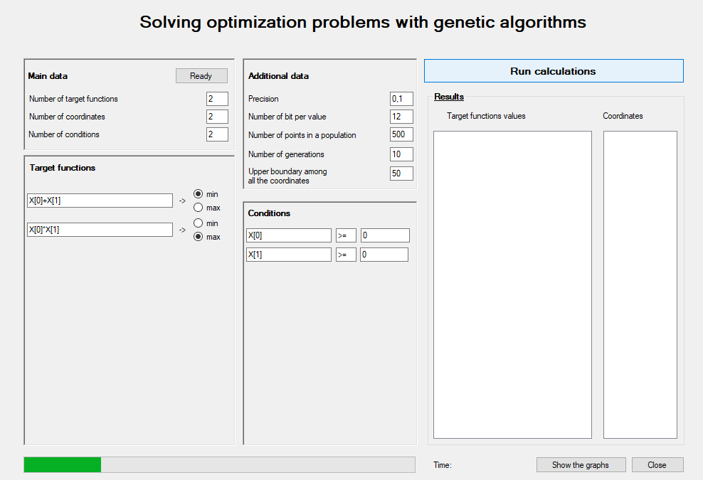
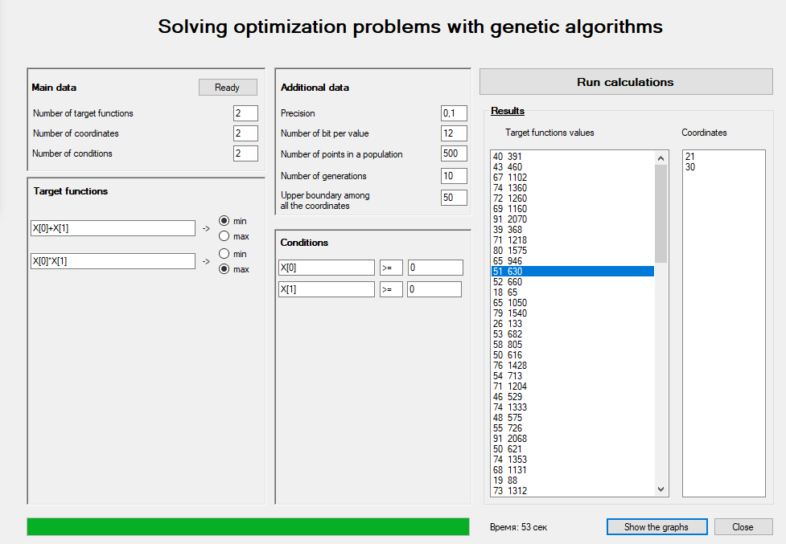
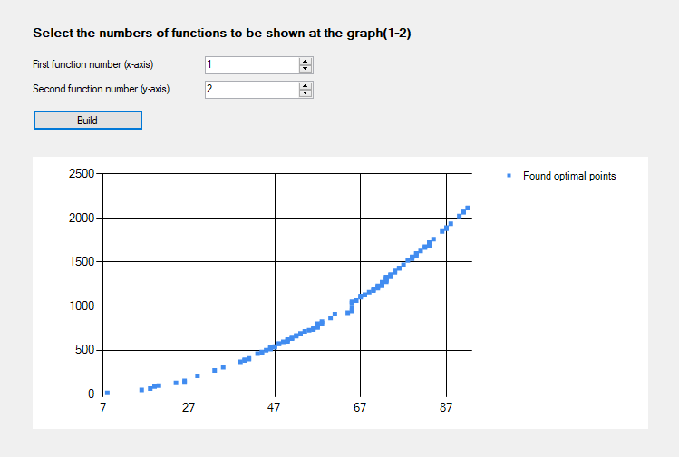

# GeneticOptimization
A Windows Desktop C# application allowing to estimate optimization problems with genetic algorithms.
The idea of the application is to provide a user with a comprehensive friendly interface to state the optimization problem and then to solve it. Additionally, the package is organized to be as scalable as possible, which means that the following values are to be defined by the end user:

1) number of target functions
2) number of variables
3) number of conditions
4) target functions themselves
5) conditions themselves

First, 'Main data' tab is filled, then after pressing 'Ready' button one might see the corresponding number of textboxes in 'Target functions' and 'Conditions' tabs. 
Some adjustments related to the genetic algorithms are then defined (in 'Additional data' tab). When everything is set up, one should press 'Run calculation' button and then wait for the application to process the results.

In this particular example we have
* 2 variables X[0] and X[1]
* First target functions is X[0]+X[1] -> min
* Second target function is X[0]*X[1]->max
* First condition X[0]>=0
* Second condition X[1]>=0

When the results are ready, one might see them in a 'Results' tab. Here, for example, one of the point from the found Pareto Frontier is (2706,3128) and the corresponding target functions values for it are (5834,8464368).

Furthermore, the application provides a user with an option to view the 2-D graphs of the found Pareto Frontier. 

NOTE! This application was built in educational purposes, which is why many of the functions are additionally implemented, although they are available through general packages (like sorting arrays etc)
